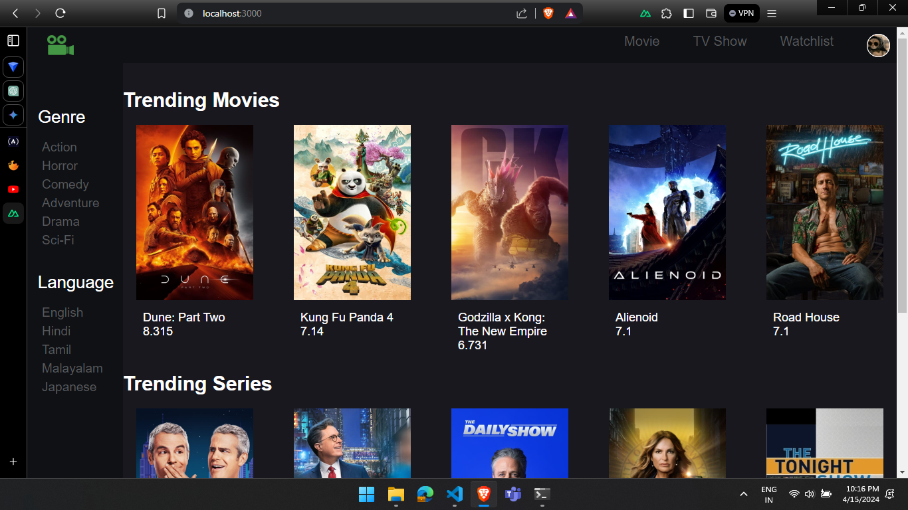
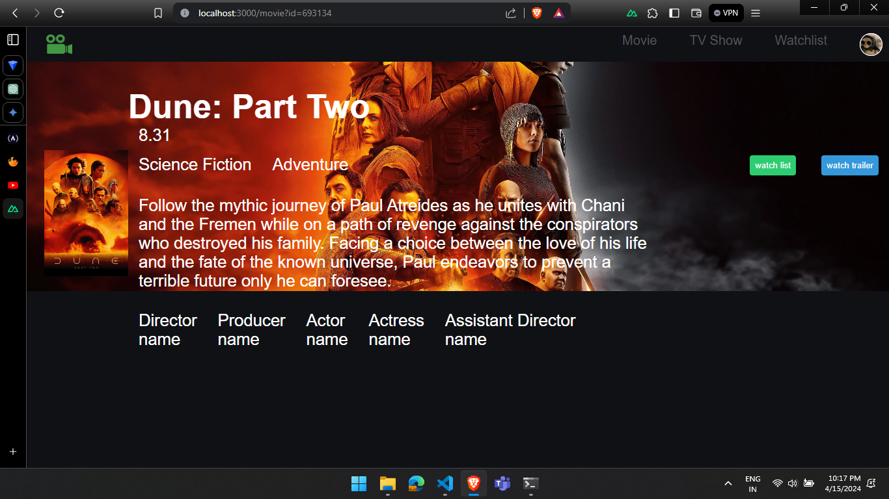

# cinema-paradiso

## Build Setup

```bash
# install dependencies
$ npm install

# serve with hot reload at localhost:3000
$ npm run dev

# build for production and launch server
$ npm run build
$ npm run start

# generate static project
$ npm run generate
```

For detailed explanation on how things work, check out the [documentation](https://nuxtjs.org).

This project is tying to replicate the famous movie review application Letterboxed 


